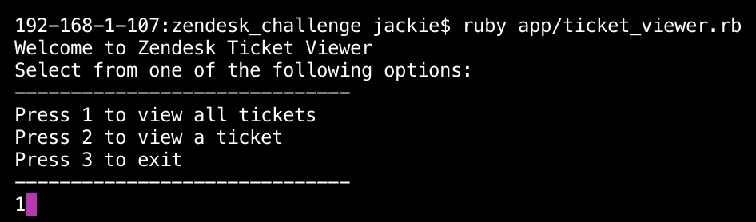
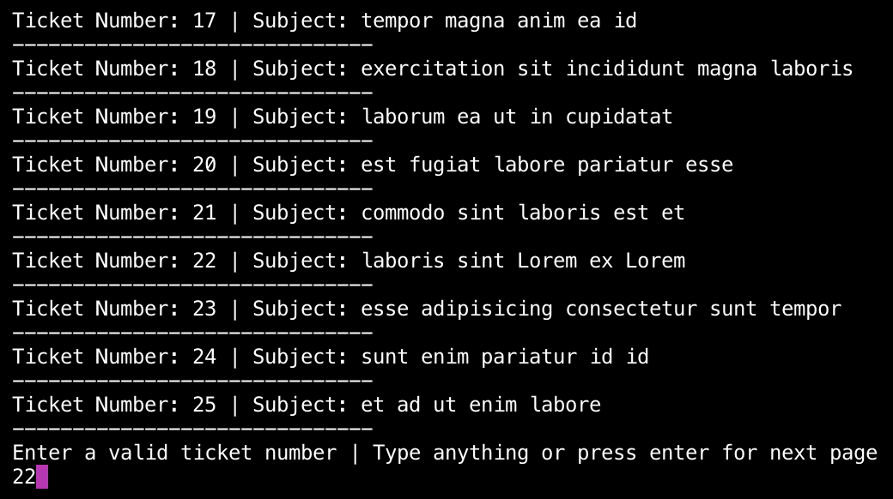
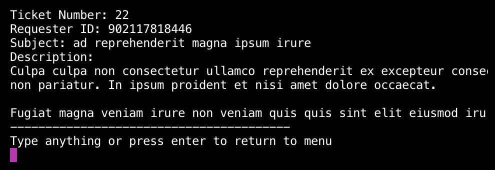

# Zendesk Ticket Viewer

Zendesk Ticket Viewer is an interactive command line application that shows users their inbox of tickets.

## Installation

Firstly, ensure you are in the correct directory in the command line terminal. You should be in the zendesk_challenge folder. You will need to have Ruby install in your system, preferably version 2.7.0 or later.

Ensure all the relevant gems are in the Gemfile and install the Bundler gem. To do this, type the following into the terminal:

### Install bundler

```bash
gem install bundler
```

And then execute:

```bash
bundle install
```

## Usage

In order to start the application, ensure you are in the command line and in the relevant folder directory. To initiate a session on the application enter the following:

```bash
    $ ruby app/ticket_viewer.rb
```

In the main menu, type 1 to view all tickets, type 2 to view a ticket and type 3 to exit the application. Press the enter or return key to submit your answer on the application.



You can display all the tickets when you type 1 or 2, but you can only view an individual ticket when you type 2. To view an individual ticket, type in the ticket number and press enter or return to select the ticket.



At the bottom of the terminal application, a message will prompt the user what to do next. If an error occurs, the application will prompt an error message.



## Testing

There are 3 automated tests which uses Rspec. To use these test, type the following into the command line:

```bash
rspec spec/ticket_viewer_spec.rb
```
